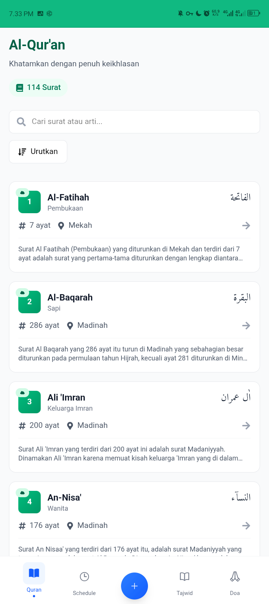
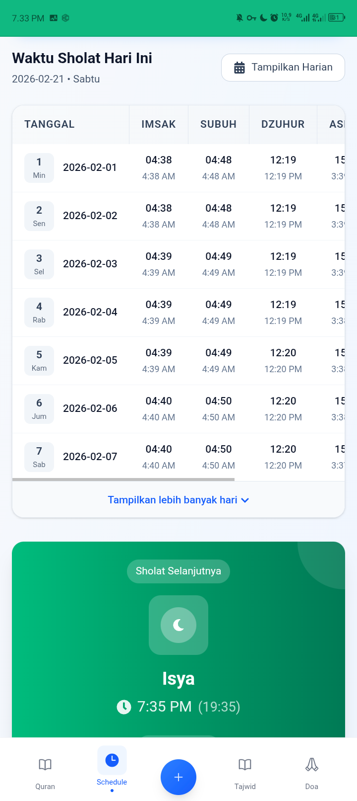
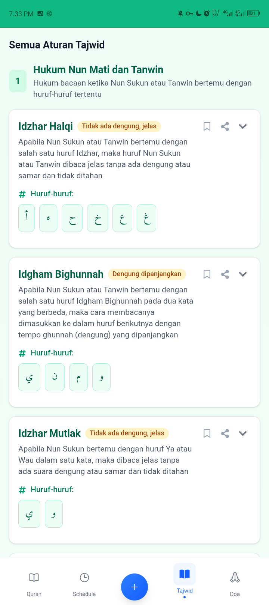
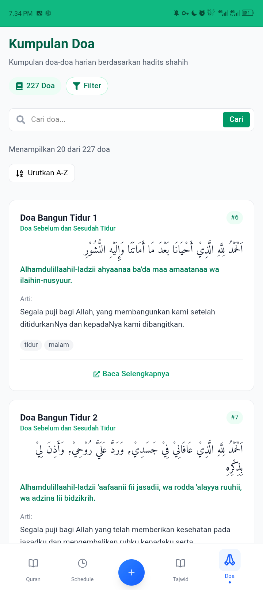
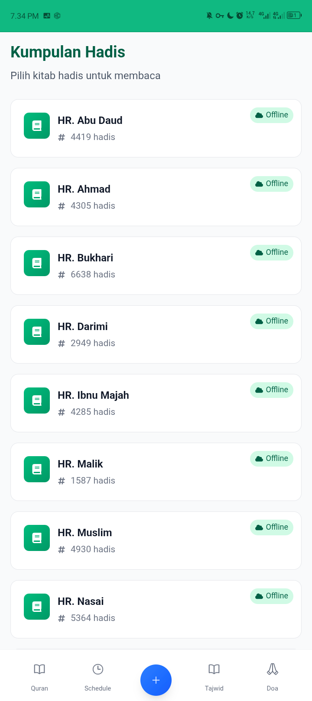

<!-- README.md dibuat secara otomatis oleh readme-generator.js -->
<div align="center">
  
  <h1>quranku</h1>
  <p><strong>Aplikasi Al-Qur'an Digital Lengkap dengan Doa, Tajwid, Hadis & Jadwal Sholat</strong></p>
  <p>Baca, dengarkan, pelajari, dan hafalkan Al-Qur'an dengan mudah. Offline-ready dan modern.</p>
</div>

<div align="center">
  <!-- Badges dinamis dari GitHub -->
  
  
  
  
  <br>
  
  
  
  
  
</div>

---

## 📱 Tentang quranku

**quranku** adalah aplikasi web progresif (PWA) yang dirancang untuk membantu umat Islam membaca, mempelajari, dan menghafal Al-Qur'an dengan nyaman. Dilengkapi dengan berbagai fitur lengkap seperti:

- **Al-Qur'an** dengan teks Arab, Latin, terjemahan Indonesia, audio murattal, dan tafsir.
- **Doa Harian** dari hadis shahih, lengkap dengan arab, latin, arti, dan keterangan.
- **Ilmu Tajwid** interaktif dengan contoh dan penjelasan mendetail.
- **Kumpulan Hadis** dari kitab-kitab utama (Bukhari, Muslim, dll.) dengan terjemahan.
- **Jadwal Sholat** untuk seluruh Indonesia (offline cache).
- **Mode Offline** – data Al-Qur'an, hadis, dan jadwal sholat dapat disimpan untuk akses tanpa internet.
- **PWA** – install sebagai aplikasi native di ponsel.
- **Bookmark & Progress Baca** – tandai ayat terakhir baca.
- **Sharing** – bagikan ayat atau doa ke media sosial.

---

## ✨ Fitur Unggulan

<div align="center">
  <table>
    <tr>
      <td align="center" width="25%">
        <span style="font-size: 2.5rem;">📖</span><br>
        <b>Al-Qur'an Digital</b><br>
        <small>114 surah + tafsir</small>
      </td>
      <td align="center" width="25%">
        <span style="font-size: 2.5rem;">🤲</span><br>
        <b>Doa Harian</b><br>
        <small>100+ doa pilihan</small>
      </td>
      <td align="center" width="25%">
        <span style="font-size: 2.5rem;">📚</span><br>
        <b>Tajwid</b><br>
        <small>lengkap + contoh</small>
      </td>
      <td align="center" width="25%">
        <span style="font-size: 2.5rem;">📜</span><br>
        <b>Hadis</b><br>
        <small>9 kitab utama</small>
      </td>
    </tr>
    <tr>
      <td align="center">
        <span style="font-size: 2.5rem;">🕌</span><br>
        <b>Jadwal Sholat</b><br>
        <small>seluruh Indonesia</small>
      </td>
      <td align="center">
        <span style="font-size: 2.5rem;">📴</span><br>
        <b>Offline Mode</b><br>
        <small>simpan data</small>
      </td>
      <td align="center">
        <span style="font-size: 2.5rem;">🔊</span><br>
        <b>Audio Murattal</b><br>
        <small>beberapa qari</small>
      </td>
      <td align="center">
        <span style="font-size: 2.5rem;">📲</span><br>
        <b>PWA</b><br>
        <small>install ke home</small>
      </td>
    </tr>
  </table>
</div>

---

## 🚀 Teknologi yang Digunakan

- **Frontend**: Next.js 15 (App Router), React 19, TypeScript
- **Styling**: Tailwind CSS, Framer Motion (animasi)
- **State & Cache**: Dexie (IndexedDB), localStorage
- **PWA & Offline**: Service Worker (workbox-style manual)
- **Ikon**: React Icons, Heroicons
- **API**:
  - Al-Qur'an & Doa: `api.devnova.icu`
  - Hadis: `api.hadith.gading.dev`
  - Jadwal Sholat: `equran.id/api/v2/shalat`
- **Deployment**: Vercel / static hosting

---


## 📸 Tampilan Aplikasi

<div align="center">
  <table>
    <tr>
<td align="center" width="50%">
  
  <br><sub>Screenshot1</sub>
</td>
<td align="center" width="50%">
  
  <br><sub>Screenshot2</sub>
</td>
</tr>
    <tr>
<td align="center" width="50%">
  
  <br><sub>Screenshot3</sub>
</td>
<td align="center" width="50%">
  
  <br><sub>Screenshot4</sub>
</td>
</tr>
    <tr>
<td align="center" width="50%">
  
  <br><sub>Screenshot5</sub>
</td>
<td></td>
</tr>
  </table>
</div>


## 🛠️ Instalasi & Menjalankan Secara Lokal

```bash
# 1. Clone repositori
git clone https://github.com/OmniCore-BEST/quranku.git
cd quranku

# 2. Install dependencies (gunakan pnpm atau npm)
pnpm install
# atau
npm install

# 3. Jalankan development server
pnpm dev
# atau
npm run dev

# 4. Buka http://localhost:3000
```

### 📦 Build untuk produksi

```bash
pnpm build
pnpm start
```

---

## 🌍 Mode PWA (Offline First)

Aplikasi ini dirancang sebagai PWA dengan strategi caching:

- **Static assets** (CSS, font, icon) di-cache saat install.
- **API Al-Qur'an & Hadis** menggunakan stale-while-revalidate – data ditampilkan dari cache (jika ada) sambil diperbarui di latar belakang.
- **Audio** disimpan di cache terpisah dengan mekanisme manual.
- **IndexedDB** digunakan untuk menyimpan data terstruktur (surah, tafsir, hadis) agar bisa diakses offline.

Fitur instalasi ke home screen tersedia (Android, iOS, desktop).

---

## 🤝 Cara Berkontribusi

Kami sangat terbuka terhadap kontribusi! Baik itu laporan bug, permintaan fitur, atau pull request.

1. **Fork** repositori ini.
2. Buat branch baru: `git checkout -b fitur-keren-anda`
3. Commit perubahan: `git commit -m 'feat: tambah fitur X'`
4. Push ke branch: `git push origin fitur-keren-anda`
5. Ajukan **Pull Request**.

Pastikan untuk mengikuti konvensi penulisan kode yang sudah ada (ESLint, Prettier).

### 📝 Panduan Kontribusi
- Gunakan TypeScript.
- Komentar kode dalam bahasa Inggris (opsional).
- Fitur baru harus diuji secara manual.
- Update README jika diperlukan.

---

## 🧑‍💻 Pengembang

Proyek ini dikelola oleh **OmniCore-BEST** dan didukung oleh komunitas **OmniCore-BEST**.

- **Pembuat**: [thiskey](https://github.com/devnovaa-id)
- **GitHub**: [OmniCore-BEST/quranku](https://github.com/OmniCore-BEST/quranku)

Kontributor (terima kasih banyak!):

<a href="https://github.com/OmniCore-BEST/quranku/graphs/contributors">
  
</a>

---

## 📄 Lisensi

Proyek ini dilisensikan di bawah **MIT License** – lihat file [LICENSE](https://github.com/OmniCore-BEST/quranku/blob/main/LICENSE) untuk detail.

---

## 📞 Kontak & Dukungan

- **Website**: [quranku.devnova.icu](https://quranku.devnova.icu)
- **Email**: this.key@devnova.icu
- **GitHub Issues**: [laporkan bug](https://github.com/OmniCore-BEST/quranku/issues)
- **Discussions**: [diskusi](https://github.com/OmniCore-BEST/quranku/discussions)

---

<div align="center">
  <sub>Dibangun dengan ❤️ oleh <a href="https://github.com/OmniCore-BEST">OmniCore-BEST</a> untuk umat Islam di seluruh dunia.</sub>
  <br>
  <sub>Open source, gratis, dan akan terus dikembangkan.</sub>
  <br>
  <br>
  <a href="https://github.com/OmniCore-BEST/quranku">
    
  </a>
  <a href="https://github.com/OmniCore-BEST/quranku/fork">
    
  </a>
</div>